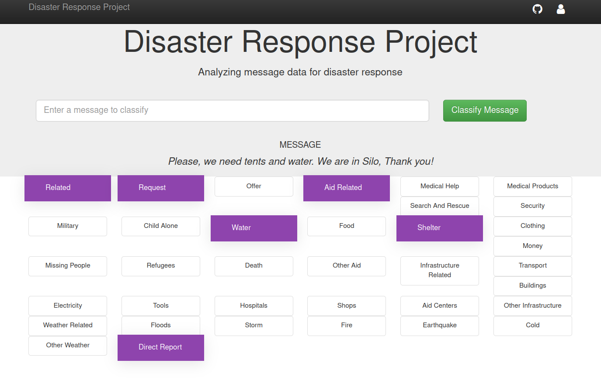

<div align="center">

# Disaster Response Pipeline Project

</div>

 --------

## Table of contents

- [Description](#description)
- [Requirements](#requirements)
- [Instructions](#instructions)
- [Results](#results)
- [Creator](#creator)
- [Copyright and license](#copyright-and-license)


## Description

Disaster's messages are very important in real-time and can help decision-makers 
to quickly act and help people in need. The current notebook provides webapp toolkit 
can be used for this purpose. It classifies the messages from social media in order to
be able to satisfy the invoked needs. To build the model, two pipelines were used. 
The first is an ETL pipeline that cleans the data and stores it in a db. The second is a ML 
pipeline that trains the classifier. 

## Requirements
The following packages are required to run the code:

```
pip install Flask
pip install sklearn2
pip install nltk
pip install SQLAlchemy
pip install pickle
```

## Instructions:
1. Run the following commands in the project's root directory to set up your database and model.

    - To run ETL pipeline that cleans data and stores in database
        `python data/process_data.py data/disaster_messages.csv data/disaster_categories.csv data/DisasterResponse.db`
    - To run ML pipeline that trains classifier and saves
        `python models/train_classifier.py data/DisasterResponse.db models/classifier.pkl`
    - A link to a pre-trained model is available [here](https://drive.google.com/file/d/1njfOW3Y-ttXozPVFQbq05Q1ZQgYx10D-/view?usp=sharing).

2. Go to `app` directory: `cd app`

3. Run your web app: `python run.py`

## Results




## Creator

**Bousbiat Hafsa**

- https://www.linkedin.com/in/hafsa-bousbiat-535ba6ba/
- https://github.com/BHafsa


## Copyright and license

Code released under the [MIT License](https://github.com/BHafsa/STEG-Fraud-Detection/blob/main/LICENSE). 


